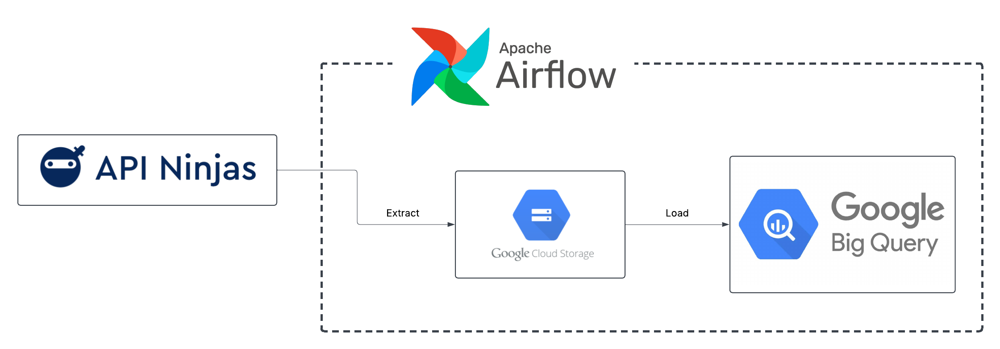
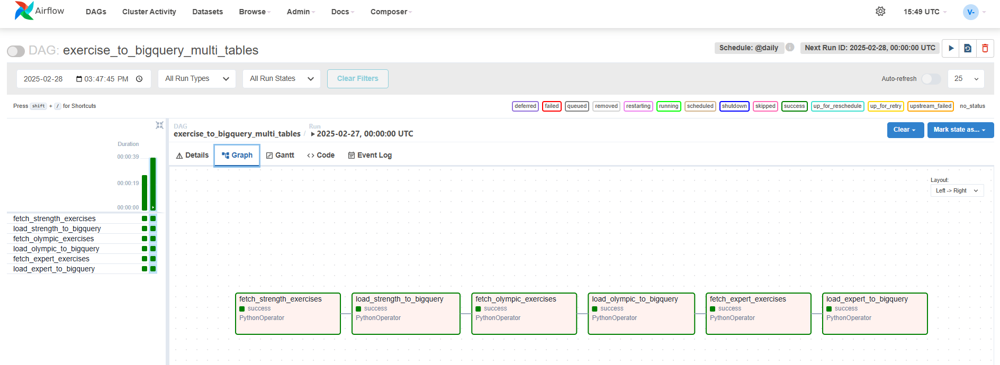
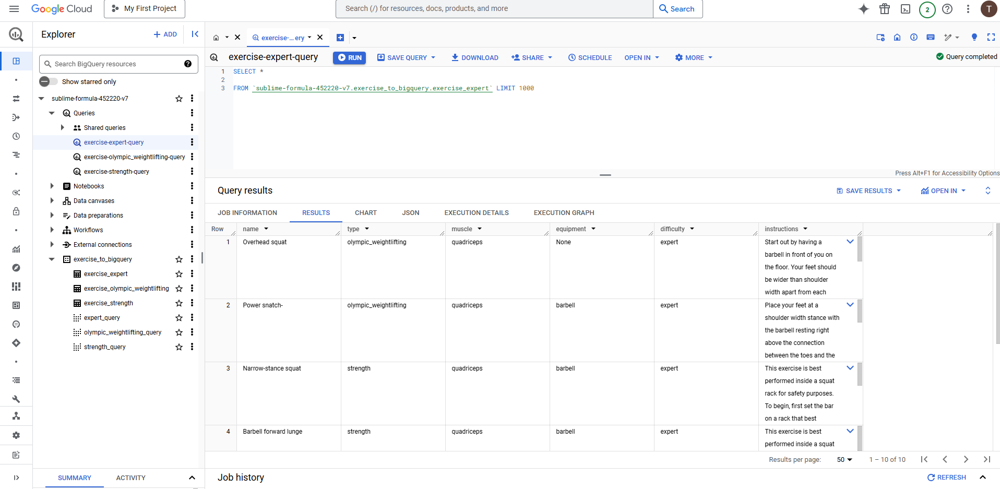

# exercise_API_data_ingest

**-The purpose of this project is to practice pulling data from a third party API to have its data ingested into BigQuery.**
 
 -The third party API site used is https://www.api-ninjas.com/.
 -An account needs to be created to utilizing an API key to pull from a HTTP link.  Free accounts limits the type of data information available and usage.
 -The free account limits to 10,000 API calls per month (pull requests/records). Some APIs, the result is limited to a default of 1 record.
 -For the purpose of this project, an Exercises API was used (https://www.api-ninjas.com/api/exercises).  This API limited the results to 5 records (although in this project, 10 records were possible).

**Details of this project:**
 -The focus is do a third party API data ingestion to BigQuery using Google Composer/Apache-Airflow.
 -This project is not an ELT or an ETL, but rather, an EL; extract the data and load the data.
 -Due to the data out being so limited, three dataset tables were created.
 -No transformation and or visualization in Power Bi.

**API Ninja Exercises API**

**API Data Ingestion Flow Chart**

**API Airflow Chart**

**BigQuery Project View**

